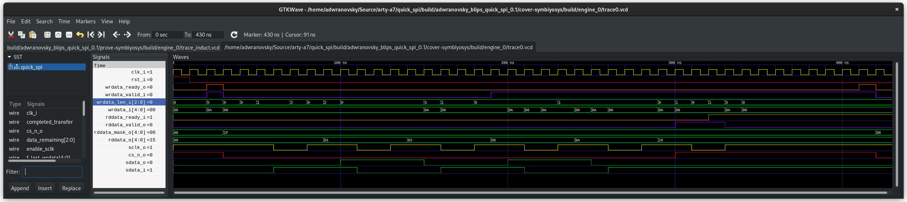

# `quick_spi`
Quickly add a SPI interface to an FPGA project

## Description
`quick_spi` is a quick way to integrate an external SPI device into an FPGA design using a simple ready/valid
handshake interface on both the read data and the write data. Additional features include support for variable
payload lengths up to a fixed number of bits, control over some common timing requirements on the SPI interface, and
support for multiple devices connected in parallel to the same SPI clock and chip select signals. 

A good reference on ready/valid handshake interfaces can be found [here](http://fpgacpu.ca/fpga/handshake.html).
A SPI transaction is started by performing a handshake on the wrdata interface, and then completed with a handshake
on the rddata interface. For more details, see the parameter and port descriptions.

All testing is done using a bounded model check and cover properties built into the module which get enabled when
`FORMAL` is defined. See the SymbiYosys `.sby` file and FuseSoC config files for details.

## Parameters
### `CLK_FREQ_HZ`
The input clock frequency
### `SCLK_FREQ_HZ`
The SPI clock frequency. The actual frequency will only match if `CLK_FREQ_HZ` / `SCLK_FREQ_HZ` is an integer.
Additionally, the frequency must be no greater than 1/4 the system clock.
### `MAX_DATA_LENGTH`
The maximum number of data bits that can be read and written per transaction
### `NUM_DEVICES`
The number of devices parallel to each other on the bus. Defaults to a single device.
### `CS_TO_SCLK_TIME`
The minimum allowed time in seconds from CS assertion to SCLK first going low
### `SDATA_HOLD_TIME`
The minimum amount of time to hold `sdata_o` steady after the rising edge of `sclk_o`
### `QUIET_TIME`
The minimum amount of time in seconds from the last bit being clocked out to the next CS assertion

## Ports
### `clk_i`
The system clock
### `rst_i`
An active high reset synchronous with `clk_i`
### `wrdata_valid_i`
Indicates that `wrdata_i` and `wrdata_len_i` are valid. A SPI transaction is only started when both `wrdata_valid_i` and
`wrdata_ready_o` are high on the same clock cycle.
### `wrdata_ready_o`
Indicates that the module is ready to accept write data for a new transaction. A SPI transaction is only started when
both `wrdata_valid_i` and `wrdata_ready_o` are high on the same clock cycle.
### `wrdata_len_i`
The number of bits from `wrdata_i` to send on `sdata_o` and to receive on `sdata_i`.
### `wrdata_i`
The data to write out serially on `sdata_o`. Only the first `wrdata_len_i` bits are used.
### `rddata_valid_o`
Indicates that `rddata_o` and `rddata_mask_o` are valid. The SPI transaction is only completed
once `rddata_valid_o` and `rddata_read_i` are high on the same clock cycle.
### `rddata_ready_i`
Indicates that the upstream device is ready to accept data. The SPI transaction is only completed once `rddata_ready_i`
and `rddata_valid_o` are high on the same clock cycle.
### `rddata_mask_o`
Indicates which bits of `rddata_o` are valid. The number of high bits matches the data length requested on
`wrdata_len_i`.
### `rddata_o`
The data read serially in on `sdata_i`. Valid when `rddata_valid_o` is high, though only the first `wrdata_len_i` bits
requested are actually valid.
### `sclk_o`
The output clock for the SPI interface, with a frequency no greater than `SCLK_FREQ_HZ`.
### `cs_n_o`
The chip select signal of the SPI interface
### `sdata_i`
The SPI data input from the SPI device
### `sdata_o`
The SPI data output to the SPI device

## Example Trace

## Dependencies
`quick_spi` depends on a few cores from my cores library, which you can find here:
[CoreOrchard](https://github.com/adwranovsky/CoreOrchard)

## License
Copyright 2022 Alex Wranovsky.

This work is licensed under the CERN-OHL-W v2, a weakly reciprocal license for hardware. You may find the full
license text here if you have not received it with this source code distribution:

https://ohwr.org/cern_ohl_w_v2.txt
